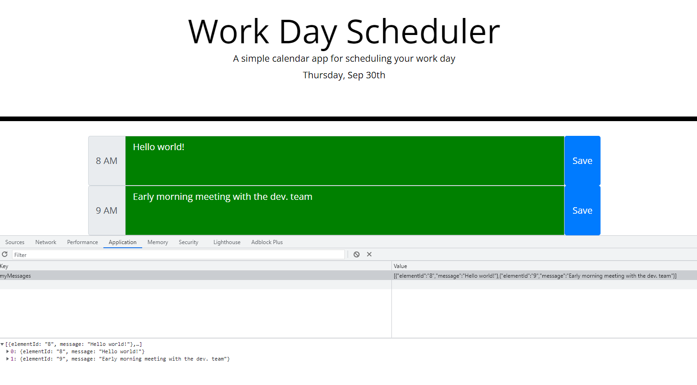

# day_planner
## Description
This project has the objective of practicing skills with JQuery and Bootstrap and moments libraries. The point was to create a day planner page where one can save messages corresponding to scheduled activities divvied up by the hours of the work day. This was also an excercise in logic, as it was imperative to find a way to save the messages and make them persist. The use of DOM manipulation through JQuery was also another skill that was heavily excercised in the process of completing this project.
## Table of Contents 
- [Installation](#installation)
- [Usage](#usage)
- [Credits](#credits)
## Installation
The page can be accessed via [this link](https://jmarq019.github.io/day_planner/).
## Usage
The user can write a message within the text box and save it. It will remain even if the page is refreshed.

## Credits
Credits go to the coding bootcamp TA's, instructor, tutors.
## Tests
Testing was done by trying out the page.